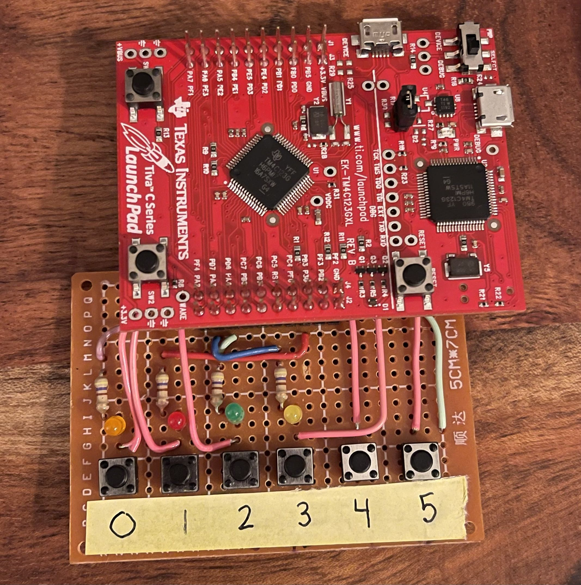

# Real-Time Operating System
This is an RTOS solution for an M4F controller that implements a preemptive RTOS solution with support for semaphores, yielding, sleep, priority scheduling, memory protection, and a shell interface.

[](picture/rtos_board.jpg)

## Scheduler (Layered Cake)
Each time the scheduler is called, it will look at all ready threads and will choose the next task to execute. There is prioritization to 8 levels (0 highest to 7 lowest). The scheduler goes through each priority level starting at the highest priority level and checks each task to see which task is ready to run. Once a task has been found the task number is incremented and stored statically so that when we return to the scheduler we can give other tasks at the same priority level a chance to run. Another way of thinking about it is that each priority level maintains a circular array which loops through N number of tasks. Hence, the name layered cake.

## Kernel Functions

### Yield
* Function yield() that will yield execution back to the kernel that will save the context necessary for the resuming the task later.

### Sleep
* Function sleep(time_ms) and supporting kernel code that will mark the task as delayed and save the context necessary for the resuming the task later. The task is then delayed until a kernel determines that a period of time_ms has expired. Once the time has expired, the task that called sleep(time_ms) will be marked as ready so that the scheduler can resume the task later.

### Wait
* Function wait(semaphore) and supporting kernel code decrements the semaphore count and returns if a resource is available or, if not available, marks the task as blocked, and records the task in the semaphore process queue.

### Post
* Function post(semaphore) and supporting kernel code that increments the semaphore count. If a process is waiting in the queue, decrement the count and mark the task as ready.

### Create Thread
* Function createThread() to store the task name and initialize the task stack as needed. This handles allocating memory space for the task stacks.

### Destroy Thread
* Function destroyThread() that removes a task from the TCB and cleans up all semaphore entries for the task that is deleted. Note the TCB entry will stay in the table.

### Restart Thread
* Function restartThread() restarts a program.

## Task Switching
When preemption is turned on the system uses the SystickISR() to force a task to yield it's resources to another task. Otherwise, it runs in cooroperative mode which lets each task run until completion or until it yields.

## Shell
A task that hosts a command line interface to the PC. The command-line interface supports the following commands (many borrowing from Linux):

#### ps 
* The PID id, task (actually thread) name, and % of CPU time should be stored at a minimum. ipcs: At a minimum, the semaphore usage should be displayed.
#### kill <PID>
* This command allows a task to be killed, by referencing the process ID.
#### reboot
* The command restarted the processor.
#### pidof <Process_Name> 
* returns the PID of a task.
#### run <Process_Name> 
* starts a task running in the background if not already running. Only one instance of a named task is allowed. The thread should start at the normal process priority (8).
#### pmap <PID> 
* displays memory usage by the process (thread) with the matching PID.
#### preempt ON|OFF
* turns preemption on or off. The default is preemption on.
#### sched PRIO|RR 
* selectes priority or round-robin scheduling. The default is priority scheduling.

## Memory Manager
A simple memory manager than allocates memory from the global heap.
For this design, the ASP bit in the CONTROL register is set so that the thread code uses the Process Stack Pointer (the handler mode will always use the MSP).

* The memory allocated will be rounded up to the nearest multiple of 1 KiB. The memory address of all allocated memory chunks will be aligned to a multiple of 1024.
#### Overall Access (background rule)
An all memory background rule that allows RW access to all memory for both privileged and unprivileged code. 
#### Flash Access
Creates a full-access MPU aperture for flash with RWX access for both privileged and unprivileged access.
#### Peripheral Access
Creates a full-access MPU aperture to peripherals and peripheral bitbanded addresses with RW access for privileged and unprivileged access.
#### SRAM Access (All)
Creates multiple MPUs regions to cover the 32KiB SRAM (each MPU region covers 8KiB, with 8 subregions of 1KiB each. With RW access for privileged mode and no access for unprivileged mode.
```c
setSramAccessWindow(uint32_t baseAdd, uint32_t size_in_bytes)
```
* allows access the the requested SRAM address range and disables access to all other addresses in SRAM. The allocated access will round up to the nearest multiple of 1 KiB.

#### SRAM Access (Restricted)
While in privileged mode, you can still access ram in the allocated range of SRAM.
While in unprivileged mode you can access flash (run code) and r/w memory from the peripherals.
While in unprivileged mode, accessing SRAM outside of the allocated range is not allowed (you will see an MPU ISR with information about the errant read/write from memory).

## Fault Handling
* If a Bus Fault ISR occurs, it displays “Bus fault in process N”
* If a Usage Fault ISR occurs, it displays “Usage fault in process N”
* If a Hard Fault ISR occurs, it displays “Hard fault in process N”. Also, provide the value of the PSP, MSP, and hard fault flags (in hex).
* If an MPU Fault ISR occurs, it displays “MPU fault in process N”. Also, provide the value of the PSP, MSP, and memory fault flags (in hex). It also prints the offending instruction and data addresses. Displays the process stack dump (xPSR, PC, LR, R0-3, R12. Clears the MPU fault pending bit and triggers a pendsv ISR call.

